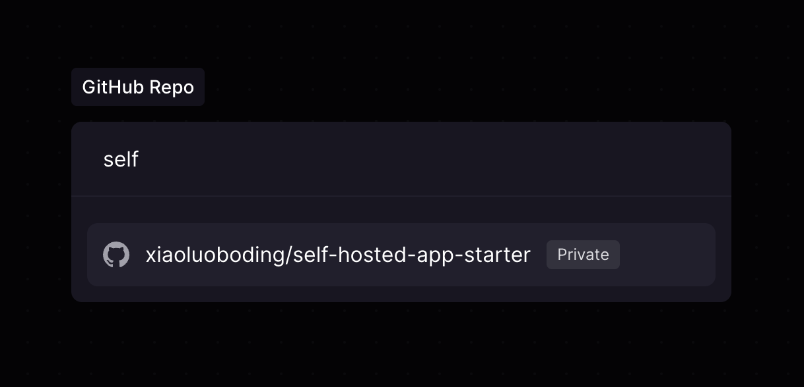
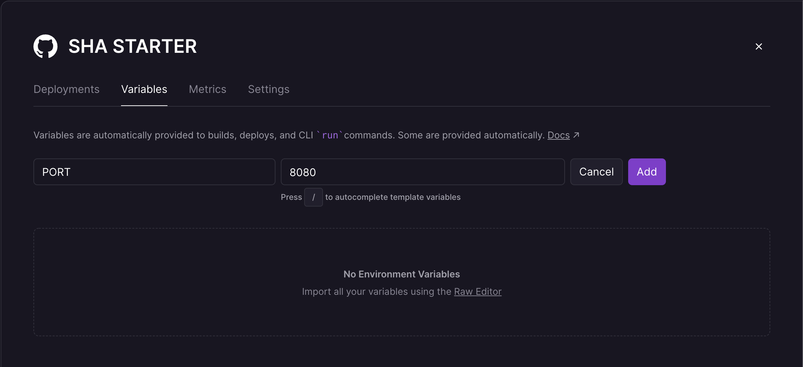

# Overview

`self-hosted-app-starter` (AKA: SHA) is a starter for the self-hosted app, help you to build your next full-stack project quickly.

`SHA` is built on top of GSVT Stack, which stands for `Go`、`SQLite`、`Vue 3`、`TailwindCSS`

If you are familiar with the `GSVT Stack`, you will love it.

## Setup the Project

Prerequisites for the starter

- [Go](https://golang.org/doc/install) (1.16 or later)
- [Air](https://github.com/cosmtrek/air#installation) (1.27.10 or later). This is for backend live reload.
- [pnpm](https://pnpm.io/installation) The front-end efficient node package manager.

## Back-end

### Start the back-end server

follow the command

```bash
pnpm run dev:be
or
air -c backend/scripts/.air.toml
```

then you will see the messages in the console:

```bash
  __    _   ___
 / /\  | | | |_)
/_/--\ |_| |_| \_ 1.27.8, built with Go 1.17.3

watching .
!exclude .air
watching api
watching bin
watching bin/server
watching bin/server/cmd
watching common
watching scripts
watching server
watching store
watching store/migration
watching store/seed
building...
running...


███████╗██╗  ██╗ █████╗     ███████╗████████╗ █████╗ ██████╗ ████████╗███████╗██████╗
██╔════╝██║  ██║██╔══██╗    ██╔════╝╚══██╔══╝██╔══██╗██╔══██╗╚══██╔══╝██╔════╝██╔══██╗
███████╗███████║███████║    ███████╗   ██║   ███████║██████╔╝   ██║   █████╗  ██████╔╝
╚════██║██╔══██║██╔══██║    ╚════██║   ██║   ██╔══██║██╔══██╗   ██║   ██╔══╝  ██╔══██╗
███████║██║  ██║██║  ██║    ███████║   ██║   ██║  ██║██║  ██║   ██║   ███████╗██║  ██║
╚══════╝╚═╝  ╚═╝╚═╝  ╚═╝    ╚══════╝   ╚═╝   ╚═╝  ╚═╝╚═╝  ╚═╝   ╚═╝   ╚══════╝╚═╝  ╚═╝

____________________________________________________

⇨ http server started on [::]:8080
```

Then the backend server has listened on `8080`

### Access the database

When you served the Go app with `Air`, it will generate a `.db` file in the dir:

```bash
.air/sha_dev.db
```

It's a SQLite database file, you can use any database tools to open it, like `TablePlus`、`DataGrid`

## Front-end

### Start the frontend server

follow the command

```bash
pnpm run dev:fe
or
cd frontend && pnpm i && pnpm run dev
```

then you will see the messages in the console:

```bash
vite v2.8.6 dev server running at:

> Local: https://localhost:3000
> Network: use `--host` to expose

ready in 669ms.
```

The app should now be running at `https://localhost:3000` and change either frontend or backend code would trigger live reload.

### Use another front-end tech-stack

The frontend project generate by [vue3-starter](https://github.com/xiaoluoboding/vue3-starter), which built on top of [vite](https://vitejs.dev/).

If you want to change the front-end tech-stack, you can follow this guide to [Scaffolding Your Vite Project](https://vitejs.dev/guide/#scaffolding-your-first-vite-project)

And configuring your `vite.config.ts` like this:

```ts
server: {
  cors: true,
  proxy: {
    '/api': {
      target: 'http://localhost:8080/',
      changeOrigin: true
    }
  }
}
```

## Deploy

### Railway

[Railway](https://railway.app/) can help you deploy an App to Production in Minutes.

### Deploy from Railway Button

[](https://railway.app/new/template/prX7No?referralCode=UEM9NF)

### Deploy from GitHub Repo



- Fork the repo first.

- When you selected the GitHub repo, It will automatically look for and use the [Dockerfile](https://github.com/xiaoluoboding/self-hosted-app-starter/blob/main/Dockerfile) at the repo's root, and deploy the services.

- It will generate a random service domain, it has not finished yet.

### Add Variable



- We must add a variable named `PORT`, value is `8080`, because the back-end server is running at `8080`

- When you click the `Add` button, it will redeploy the service automatically.

- And now you can visit the service domain.

### Change Service Domain

Now you can change the service domain as you wish

like: [https://self-hosted-app-starter.up.railway.app/](https://self-hosted-app-starter.up.railway.app/)
